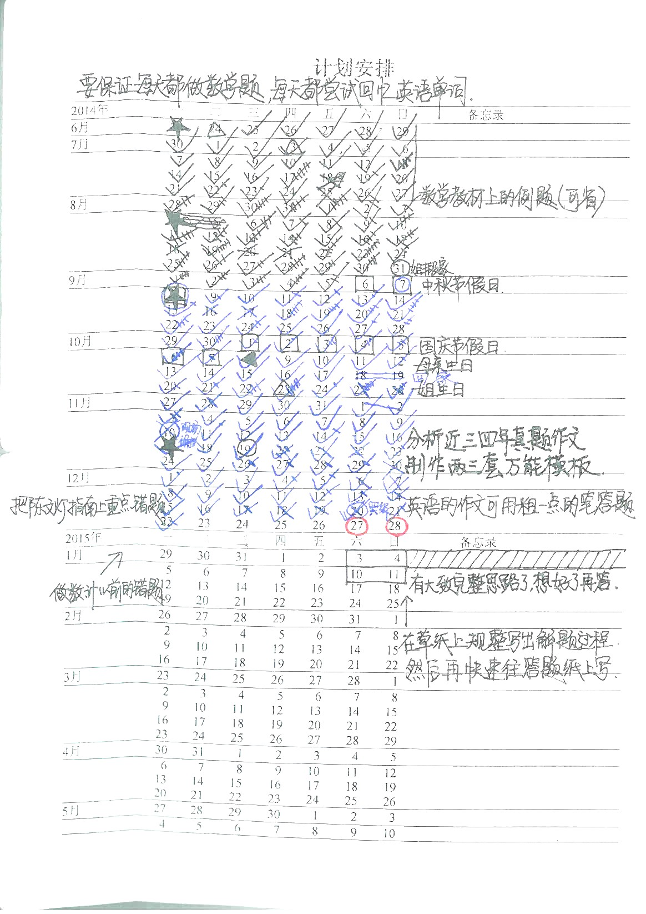

# Agenda
PLANS in CALENDER

## The Java source codes could be extracted from the jar file.

## There are some interface bugs if you run it on the Ubuntu system, which should be OK on the Windows system.

## Choose the file named Agenda_TwoLines_new_english_optimized_20180817.jar to make it executable, then run it.

